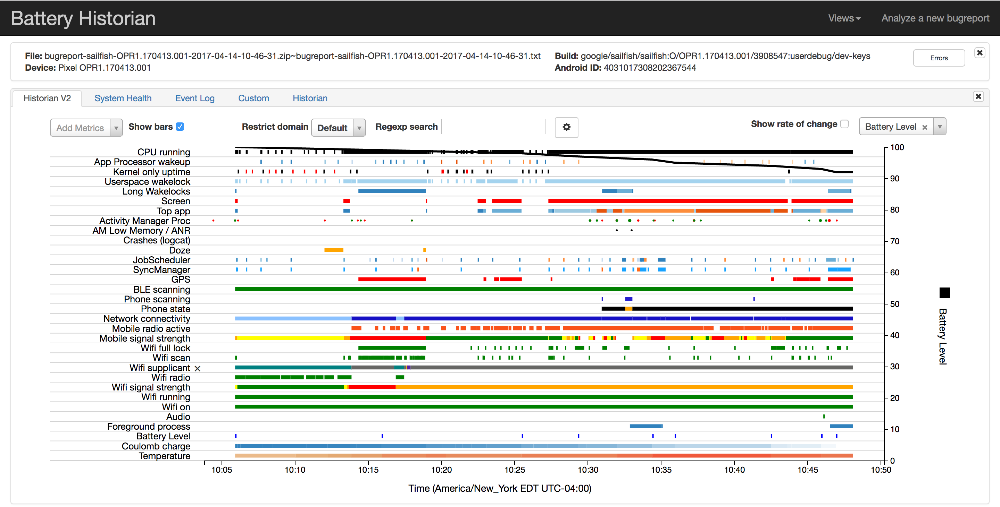

# LearnEcharts
最近工作需要通过web呈现一个数据的可视化的图，这个工程的目的仅仅是学习怎么用echars来做这件事。  
这个图类似Android电量分析的[battery-historian](https://github.com/google/battery-historian)。  
  
画出手机状态时间线，同时，在时间线图上再画一些曲线(涉及多个Y轴)。  

## Hello world  
[5分钟上手echarts](http://echarts.baidu.com/tutorial.html#5%20%E5%88%86%E9%92%9F%E4%B8%8A%E6%89%8B%20ECharts)  

## 几个值得的参考  
[事件Timeline](http://echarts.baidu.com/examples/editor.html?c=custom-profile)  
[多图联动](http://echarts.baidu.com/echarts2/doc/example/mix8.html)

## 坑  
- 因为画的是timeline图，所以xAxis.type设置成了'time'。但是，设成time后发现echarts渲染非常卡顿(数据量比较大)，尤其是在缩放图片和调整坐标位置的时候。这时候把[series.showSymbol设为false](https://lonhon.top/2018/05/08/ECharts-UI-lags-when-xAxis-type-is-time/)就能解决。  

## 一点收获  
- javascript的[Array.prototype.map()](https://developer.mozilla.org/en-US/docs/Web/JavaScript/Reference/Global_Objects/Array/map)功能非常好用，对Array中的元素做相同处理的时候，比for优雅得多。  